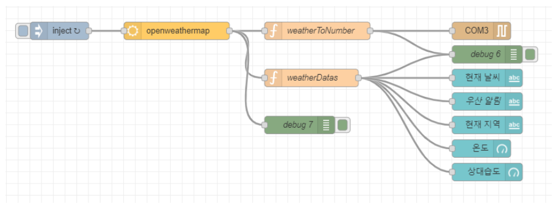

# Node-RED Descriptions

## Flow

### weatherToNumber

Convert weather data from openweathermap to predefined numbers

### weatherDatas

Set up weather data to display data on dashboard

|          Weather          | Numeric Data |
| :-----------------------: | :----------: |
|           Clear           |      1       |
|          Clouds           |      2       |
| Rain/Thunderstorm/Drizzle |      3       |
|           Snow            |      4       |
|           None            |      9       |

### 현재 날씨

- Value format: {{msg.weather}}
- Display current weather from openweathermap in the location established by the user

### 우산 알림

- Value format: {{msg.message}}

### 현재 지역

- Value format: {{msg.location}}

### 온도

- Value format: {{msg.temperature}}

### 상대습도

- Value format: {{msg.payload.humidity}}
